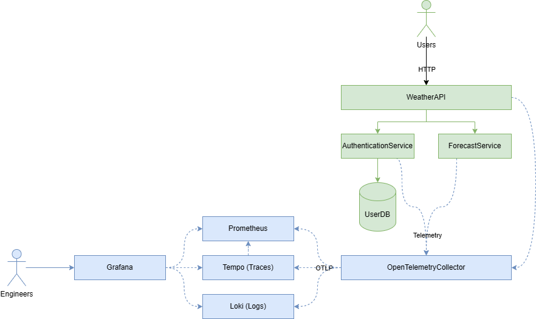

# .NET OpenTelemetry walk-through

This repository contains a solution for a fictional weather forecasting company, called weather.io.

I originally built this system as a demo for my "Better Observability in .NET with OpenTelemetry" talk, but I think the community may find it useful to use as a bit of a "playground" to familiarise themselves with OpenTelemetry, as well as some of the open-source observability tooling, such as Grafana and Prometheus.

## Architecture

## What can you do with this repo?

Both the WeatherAPI and the ForecastService are already instrumented, so you could start by exploring the configuration, and then following the [AuthenticationService Instrumentation](docs/AuthenticationServiceInstrumentation.md) guide to walk through using OpenTelemetry to instrument a service, from scratch. 

## Getting Started

1. Clone the repo
2. Open in Visual Studio and start debugging the `docker-compose` launch profile
3. Open Grafana at http://localhost:3000

> [!NOTE]
> `docker compose up` does not currently work with this solution, so running from Visual Studio is recommended.

> [!NOTE]  
> Don't worry if you get intermittent 500 errors or exceptions when running this project. These errors are intentional to show how exceptions are handled within the telemetry.

## Roadmap

This repository doesn't cover everything, yet. Here's some things I'd like to add, contributions are welcome if you'd like to have a go yourself:

- Grafana Dashboards for visualising service health.
- Instrument the services with custom metrics.
- Add new services to show additional features, such as trace context propogation across message boundaries. E.G. Azure ServiceBus, RabbitMq, or even Kafka.
