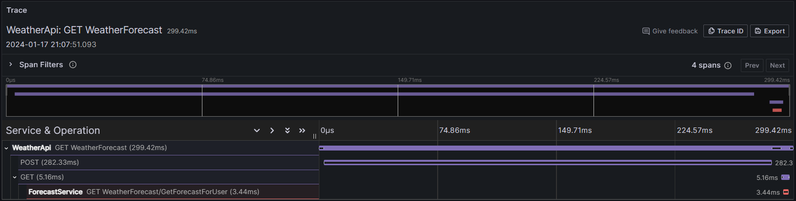
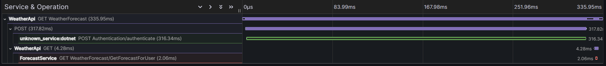
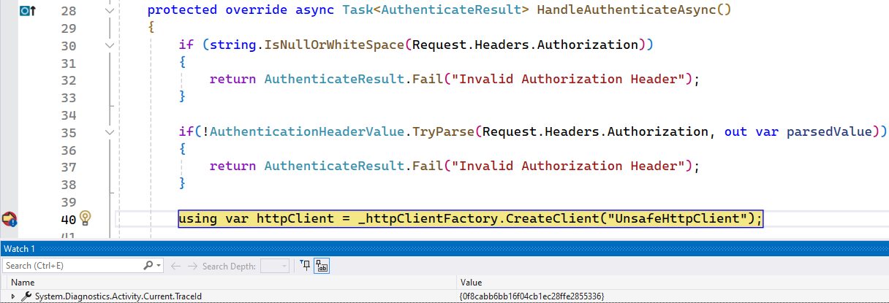
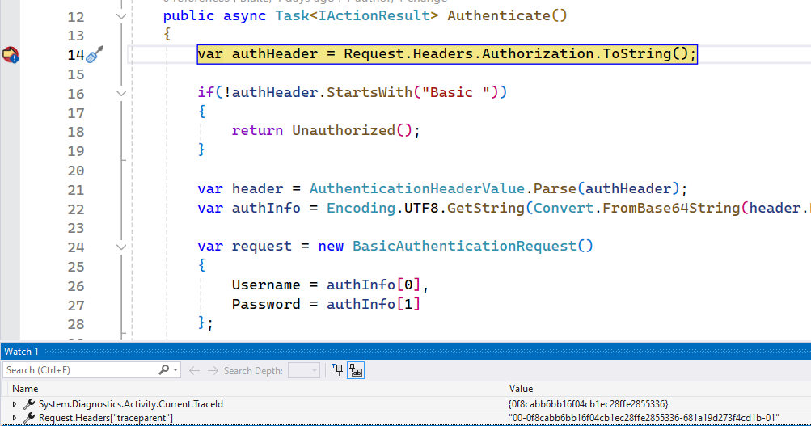
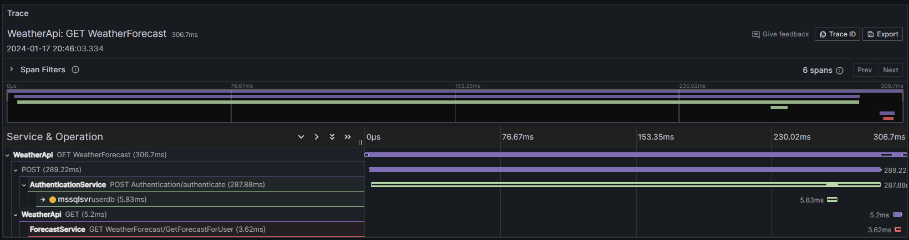
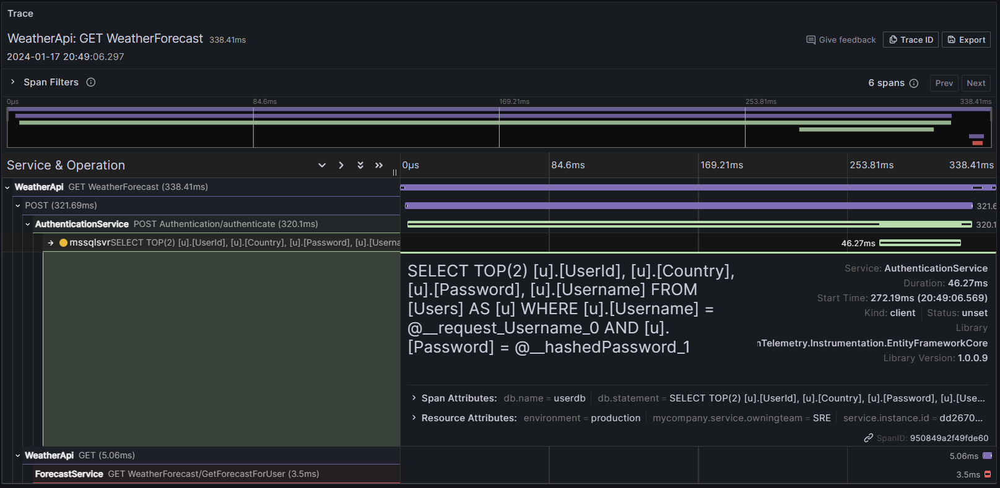
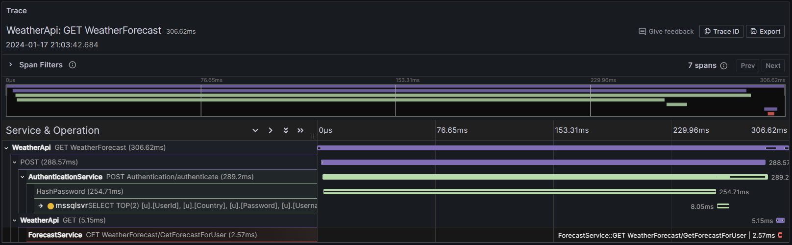

# Instrumenting the AuthenticationService

If we load up a trace in Grafana we can see spans for the WeatherApi and the ForecastService, and we can see the WeatherApi making a `POST` request to the AuthenticationService, but that's currently a black hole; we can't see how the AuthenticationService is handling the request, and why it's taking so long.



[!NOTE]  
You'll fire off multiple requests to the WeatherApi during this walkthrough, don't worry if you get a 500 error intermittently, this is intentional to show how exceptions are displayed in the traces!

## Starting with the basics

The first thing we need are the `OpenTelemetry` NuGet packages. Since I use this system for a demo the packages are already installed, but you can go ahead and take a look at the AuthenticationService csproj file to see what's been added.

```xml
<ItemGroup>
  <!--Startup extensions and core pkg (OpenTelemetry)-->
  <PackageReference Include="OpenTelemetry.Extensions.Hosting" Version="1.7.0" />
  
  <!--Additional instrumentation packages-->
  <PackageReference Include="OpenTelemetry.Instrumentation.Http" Version="1.7.0" />
  <PackageReference Include="OpenTelemetry.Instrumentation.AspNetCore" Version="1.7.0" />
  <PackageReference Include="OpenTelemetry.Instrumentation.EntityFrameworkCore" Version="1.0.0-beta.9" />

  <!--Exporter packages-->
  <PackageReference Include="OpenTelemetry.Exporter.Console" Version="1.7.0" />
  <PackageReference Include="OpenTelemetry.Exporter.OpenTelemetryProtocol" Version="1.7.0" />
</ItemGroup>
```

Here we have:
- `OpenTelemetry.Extensions.Hosting` - this imports the core `OpenTelemetry` packages along with some useful startup extensions.
- `OpenTelemetry.Instrumentation.xxx` - these packages contain extension methods for configuring instrumentation for different libraries/frameworks/services.
- `OpenTelemetry.Exporter.xxx` - these packages contain exporters, which send telemetry to different back-end systems.

Let's go ahead and configure some basic tracing instrumentation so we can see our incoming HTTP requests. Add the following code to `Program.cs`:

```csharp
using OpenTelemetry.Trace;

builder.Services.AddOpenTelemetry()
    .WithTracing(tracing =>
    {
        tracing.AddAspNetCoreInstrumentation();

        tracing.AddConsoleExporter();
    });
```

Here, we're calling `AddOpenTelemetry()` to register the OpenTelemetry services in our `IServiceCollection`. We then call enable tracing by calling `.WithTracing(...)` with a delegate to configure a `TracerBuilderProvider` according to our requirements. In this case, we're keeping it simple and enabling AspNetCore instrumentation, so we get a span for each incoming HTTP request, and we're exporting those spans to the console.

Start debugging and send a request to the WeatherApi to invoke the `AuthenticationService`, and then take a look at the console logs.

```
2024-01-17 19:55:19 Activity.TraceId:            557fb4361246fbe0505796250d7e6ac9
2024-01-17 19:55:19 Activity.SpanId:             25cd5f783474ee2b
2024-01-17 19:55:19 Activity.TraceFlags:         Recorded
2024-01-17 19:55:19 Activity.ParentSpanId:       cd89132eeac3b423
2024-01-17 19:55:19 Activity.ActivitySourceName: Microsoft.AspNetCore
2024-01-17 19:55:19 Activity.DisplayName:        POST Authentication/authenticate
2024-01-17 19:55:19 Activity.Kind:               Server
2024-01-17 19:55:19 Activity.StartTime:          2024-01-17T19:55:19.2705340Z
2024-01-17 19:55:19 Activity.Duration:           00:00:00.3171792
2024-01-17 19:55:19 Activity.Tags:
2024-01-17 19:55:19     server.address: authenticationservice
2024-01-17 19:55:19     http.request.method: POST
2024-01-17 19:55:19     url.scheme: https
2024-01-17 19:55:19     url.path: /authentication/authenticate
2024-01-17 19:55:19     network.protocol.version: 1.1
2024-01-17 19:55:19     http.route: Authentication/authenticate
2024-01-17 19:55:19     http.response.status_code: 200
2024-01-17 19:55:19 Resource associated with Activity:
2024-01-17 19:55:19     telemetry.sdk.name: opentelemetry
2024-01-17 19:55:19     telemetry.sdk.language: dotnet
2024-01-17 19:55:19     telemetry.sdk.version: 1.7.0
2024-01-17 19:55:19     service.name: unknown_service:dotnet
```

We've got our span exported to the console, the reason all the properties are prefixed with `Activity.*` is because the `System.Diagnostics.Activity` class represents a span in .Net. .Net is unique in the OpenTelemetry ecosystem, in thaat we already had a type (`Activity`) that was being used to instrument services and produce events (Etw events to be exact), so rather than start from scratch the .Net team decided to re-use `Activity` to implement the OpenTelemetry spec. Just for clarity `Span == Activity`.

Most of these fields are self explanatory, but lets take a look at some of them:
- `TraceId` - Randomly generated identifier that represents the "full path" a request takes through your system. 
- `SpanId` - Randomly generated identifier that represents the current operation.
- `DisplayName` - A friendly name for the current operation.
- `Tags` - Additional attributes added manually, or by instrumentation libraries, to add rich context to telemetry data.
- `Resource associated with Activity` - Attributes for the service that produced the span.
  
We've got some useful information here like the status code and the duration, so lets export this to the `OpenTelemetryCollector`, which forwards the events on to `Tempo` for us. Replace `AddConsoleExporter` with the following snippet:

```csharp
tracing.AddOtlpExporter(options =>
{
    options.Endpoint = new Uri("http://collector:4317");
});
```

This tells OpenTelemetry that we want to export spans using the OTLP protocol, and we've provided the endpoint to send them to. In our case this is the url of the OpenTelemetryCollector running in docker. 

Let's start debugging and send another request, then open up Grafana:



### Setting resource attributes

Our span is being exported, but the name of the service isn't right: `"unknown_service:dotnet"`

Let's fix that, and add some other useful attributes. Add this code just below `AddOpenTelemetry()`:

```csharp
builder.Services.AddOpenTelemetry()
    .ConfigureResource(resource => // Add this
    {
        resource.AddService(builder.Environment.ApplicationName,
            serviceNamespace: "otelTalk",                                                // Group related services
            serviceVersion: Assembly.GetEntryAssembly()!.GetName().Version!.ToString()); // REALLY useful for deployment tracking

        var attributes = new Dictionary<string, object>()
        {
            { "environment", "production" },            // Check the docs for your APM tool for correct naming. (DataDog is deployment.environment)
            { "mycompany.service.owningteam", "SRE" }   // Useful for filtering and alerting
        };

        resource.AddAttributes(attributes);
    })
    .WithTracing(tracing =>
        // ...
```

Here we're calling `ConfigureResource` to set some resource level attributes that apply to all spans produced by this service. The call to `AddService()` specifies a service name, namespace and version (adding the version is probably the single most useful attribute you can add to help diagnose issues with new releases!). We're also adding some custom attributes, like the `environment` and `owningteam`.

Again, start debugging, send a request and view the trace in Grafana.

## How is trace context propogated?

We've got some basic instrumentation for our `AuthenticationService`, now is a good time to get the debugger out and figure out how trace context is propogated between services.

Set a couple of breakpoints, start debugging, then send a request:

- `WeatherApi` > `BasicAuthenticationHandler` > `using var httpClient = _httpClientFactory.CreateClient("UnsafeHttpClient");`
- `AuthenticationService` > `AuthenticationController` > `Authenticate` > `var authHeader = Request.Headers.Authorization.ToString();`

When the first breakpoint gets hit in the `WeatherApi`, open the `Watch` window and add a watch for `System.Diagnsotics.Activity.Current`. `Activity.Current` is a `static AsyncLocal`, and contains the context for the current trace. Take note of the `TraceId` and continue execution.



When you hit the second breakpoint in the `AuthenticationService`, use the `locals` tab to view the `Request.Header` values. Here you should see a header called `traceparent`, containing the `traceid` we took note of in the previous breakpoint!



To summarise what we just saw: trace context is propogated across HTTP boundaries via the HTTP headers. This works as `HttpClient` is "OpenTelemetry aware" - it will always add a `traceparent` header if `Activity.Current` is set. 

## Instrumenting database queries

Let's get back to instrumenting our code. We know from our architecture diagram that the `AuthenticationService` talks to a database - it's probably a reasonable assumption that all that latency is coming from the database right? After all, it's always the database... or the network.

Luckily, we don't have to go and instrument every database query in our code, we can just add `tracing.AddEntityFrameworkCoreInstrumentation();` to our `WithTracing(...)` delegate.

You know the drill, start debugging, fire of a request, view the results in Grafana:



### Enriching the spans

The database span is useful - we now know it's not the database causing our latency! But it'd be nice if the database span told us what query was being executed, as in a larger system we probably have tens of queries being executed per http request, so knowing which ones are causing problems is useful.

Most of the `AddxxxInstrumentation` extension methods accept a delegate that allows you to configure the spans that are being produced. This is useful for customising the spans, or in some cases, filtering them out. Replace the `AddEntityFrameworkCoreInstrumentation` call with this new call:

```csharp
tracing.AddEntityFrameworkCoreInstrumentation(x=>
{
    //x.SetDbStatementForText = true;
    x.EnrichWithIDbCommand = (activity, command) =>
    {
        activity.AddTag("db.statement", command.CommandText);
        activity.DisplayName = command.CommandText;
    };
});
```

Now we're calling `EnrichWithIDbCommand` which gives us the `Activity` and the `IDbCommand`, so we can add any attributes we'd like from the command object. In this case we're going to add a `db.statement` tag and update the display name to the command text. (This can be very useful in systems like DataDog, where metrics are calculated from spans and the `DisplayName` is used as a metric dimension - this means we can get client side database metrics for each query!).

Fire off another request and view the result in Grafana:



## Custom instrumentation

If we take a look at the `AuthenticateUser` method within the `AuthenticationService`, we can see it does two things:
1. Hash the users password
2. Query the database to find the user

We know the query isn't taking all the time, so could it be the `HashPassword()` method? Unfortunately there's no `AddHashPasswordInstrumentation` library, but we can add our own instrumentation by wrapping the code in an `Activity`.

First, we need an `System.Diagnostics.ActivitySource` to create activities from, so add the following field to the top of the `AuthenticationService` class.

```csharp
private readonly ActivitySource _activitySource = new("mycompany.instrumentation");
```

`mycompany.instrumentation` is the name of the activity source, and we'll use this later to tell OpenTelemetry to listen to activites produced by this  `ActivitySource`.

Next, wrap our `HashPassword()` logic with an `Activity`, by calling `ActivitySource.StartActivity(name)`:

```csharp
using var activity = _activitySource.StartActivity(nameof(HashPassword));
```

Notice how this is `IDisposable`? That's because the `Activity` needs to know when the operation is over, which is controlled by calling `Dispose();`.

Finally, let's tell OpenTelemetry to listen to spans from our custom `ActivitySource` by calling `tracing.AddSource(...)` back in our Program.cs file.

```csharp
tracing.AddSource("mycompany.instrumentation");
```

Fire up the debugger, and take a look at the trace in Grafana:



Now we know exactly what's causing our additional latency!